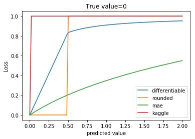
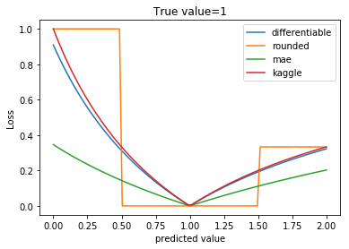

# Kaggle Web Traffic Time Series Forecasting
1st place solution

Main files:
 * `make_features.py` - builds features from source data
 * `input_pipe.py` - TF data preprocessing pipeline (assembles features
  into training/evaluation tensors, performs some sampling and normalisation)
 * `model.py` - the model
 * `trainer.py` - trains the model(s)
 * `hparams.py` - hyperpatameter sets.
 * `submission-final.ipynb` - generates predictions for submission

How to reproduce competition results:
1. Download input files from https://www.kaggle.com/c/web-traffic-time-series-forecasting/data :
`key_2.csv.zip`, `train_2.csv.zip`, put them into `data` directory.
 Also download supplemental scraped data file
`2017-08-15_2017-09-11.csv.zip`. It possibly contains more recent data for the last
day than an official file.
2. Run `python make_features.py data/vars --add_days=63`. It will
extract data and features from the input files and put them into
`data/vars` as Tensorflow checkpoint.
3. Run trainer:
`python trainer.py --name s32 --hparam_set=s32 --n_models=3 --do_eval=False --forward_split=False
 --asgd_decay=0.99 --max_steps=11500 --save_from_step=10500`. This command
 will simultaneously train 3 models on different seeds (on a single TF graph)
 and save 10 checkpoints from step 10500 to step 11500 to `data/cpt`.
 __Note:__ training requires GPU, because of cuDNN usage. CPU training will not work.
 If you have 3 or more GPUs, add `--multi_gpu=true` flag to speed up the training. One can also try different
hyperparameter sets (described in `hparams.py`): `--hparam_set=definc`,
`--hparam_set=inst81`, etc.
Don't be afraid of displayed NaN losses during training. This is normal,
because we do the training in a blind mode, without any evaluation of model performance.
4. Run `submission-final.ipynb` in a standard jupyter notebook environment,
execute all cells. Prediction will take some time, because it have to
load and evaluate 30 different model weights. At the end,
you'll get `submission.csv.gz` file in `data` directory.

# How model works
There are two main information sources for prediction:
1. Local features. If we see a trend, we expect that it will continue
 (AutoRegressive model), if we see a traffic spike, it will gradually decay (Moving Average model),
 if wee see more traffic on holidays, we expect to have more traffic on
 holidays in the future (seasonal model). These features
are relatively straightforward, so any ARIMA or more advanced Prophet model
 can handle them.
2. Global features. If we look to autocorrelation plot, we'll notice strong
year-to-year autocorrelation and perceptible quarter-to-quarter autocorrelation.

The good model should use both global and local features, combining them
in a intelligent way depending on a signal strength.

I decided to use RNN seq2seq model for prediction, because of:
1. RNN can be thought as a natural extension of well-studied ARMA models, but much more
adaptable, flexible and expressive.
2. RNN is non-parametric, that's greatly simplifies learning.
Imagine feedling with ARIMA parameters om 145K timeseries.
3. Any exogenous feature (numerical or categorical, time-dependent or series-dependent)
 can be easily injected into the model
4. seq2seq seems natural for this task: we predict next values, conditioning on joint
probability of previous values, including our past predictions. Use of past predictions
stabilises the model, it learns to be conservative, because error accumulates on each step,
and extreme prediction at one step can ruin entire prediction sequence.
5. Deep Learning is all the hype nowadays )

## Feature engineering
I tried to be minimalistic, because RNN is powerful enough to discover
and learn features on its own.
Model feature list:
 * *pageviews* (spelled as 'hits' in the model code, because of my web-analytics background).
 Raw values transformed by log1p() to get more-or-less normal intra-series values distribution,
 instead of skewed one.
 * *agent*, *country*, *site* - these features are extracted from page urls and one-hot encoded
 * *day of week* - to capture weekly seasonality
 * *year-to-year autocorrelation*, *quarter-to-quarter autocorrelation* - to capture yearly and quarterly seasonality strength.
 * *page popularity* - High traffic and low traffic pages have different traffic change patterns,
 this feature (median of pageviews) helps to capture traffic scale.
 This scale information is lost in a *pageviews* feature, because each pageviews series
 independently normalized to zero mean and unit variance.
 * *lagged pageviews* - I'll describe this feature later

## Feature preprocessing
All features (including one-hot encoded) are normalized to zero mean and unit variance. Each *pageviews*
series normalized independently.

Time-independent features (autocorrelations, country, etc) are "stretched" to timeseries length
i.e. repeated for each day by `tf.tile()` command.

Model trains on random fixed-length samples from original timeseries. For example,
if original timeseries length is 600 days, and we use 200-day samples for training,
we'll have a choice of 400 days to start the sample.

Such sampling works as effective data augmentation mechanism:
model code randomly chooses starting point for each timeseries on each training
 step, generating practically endless stream of non-repeating data.


## Model core
Model has two main parts: encoder and decoder.

Encoder is [cuDNN GRU](https://www.tensorflow.org/versions/master/api_docs/python/tf/contrib/cudnn_rnn/CudnnGRU). cuDNN works much faster (5x-10x) than native Tensorflow RNNCells, at the cost
 of some inconvenience to use and poor documentation.

Decoder is TF `GRUBlockCell`, wrapped in `tf.while_loop()` construct. Code
inside the loop gets prediction from previous step and
 appends it to the input features for current step.

## Losses and regularization
[SMAPE](https://en.wikipedia.org/wiki/Symmetric_mean_absolute_percentage_error)
 (target loss for competition) can't be used directly, because of unstable
behavior near zero values (loss is a step function if truth value is zero,
 and not defined, if predicted value is also zero).

I used smoothed differentiable SMAPE variant, which is well-behaved at all real numbers:
```python
epsilon = 0.1
summ = tf.maximum(tf.abs(true) + tf.abs(predicted) + epsilon, 0.5 + epsilon)
smape = tf.abs(predicted - true) / summ * 2.0
```



Another possible choice is MAE loss on `log1p(data)`, it's smooth almost everywhere
and close enough to SMAPE for training purposes.

Final predictions were rounded to the closest integer, negative predictions clipped at zero.

I tried to use RNN activation regularizations from the paper
["Regularizing RNNs by Stabilizing Activations"](https://arxiv.org/abs/1511.08400),
because internal weights in cuDNN GRU can't be directly regularized
(or I did not found a right way to do this).
Stability loss did'nt work at all, activation loss gave some very
 slight improvement for low (1e-06..1e-05) loss weights.

## Training and validation
I used COCOB optimizer (see paper [Training Deep Networks without Learning Rates Through Coin Betting](https://arxiv.org/abs/1705.07795)) for training, in combination with gradient clipping.
COCOB tries to predict optimal learning rate for every training step, so
I don't have to tune learning rate at all. It also converges considerably
faster than traditional momentum-based optimizers, especially on first
epochs, allowing me to stop unsuccessful experiments early.

Validation

## Reducing model variance
Model has inevitably high variance due to very noisy input data. To be fair,
I was surprised that RNN learns something on such noisy data at all.

Same model trained on different seeds can show radically different performance,
sometimes model even diverges. During training, performance also wildly
fluctuates from step to step. I can't just rely on luck (be on right
 seed and stop on right training step) to precisely predict future values
and win the competition, so I had to take actions to reduce variance.

1. I don't know which training step would be best for predicting the future
 (validation result on current data is very weakly correlated with a
  result on a future data), so I can't use early stopping. But I know
  approximate region where model is (possibly) trained well enough,
  but (possibly) not started to overfit. I decided to set this optimal region
  bounds to 10500..11500 training steps and save 10 checkpoints from each 100th step
  in this region.
2. Similarly, I decided to train 3 models on different seeds and save checkpoints
from each model. So I have 30 checkpoints total.
3. One widely known method for reducing variance and improving model performance
is SGD averaging (ASGD). Method is very simple and well supported
in [Tensorflow](https://www.tensorflow.org/versions/r0.12/api_docs/python/train/moving_averages)
 - one have to maintain moving averages of trainable variables during training and use these
averaged weights, instead of original ones, during inference.

Combination of all three methods (average predictions from 30 checkpoints
and use averaged model weights in each checkpoint) worked well, I got
 roughly the same SMAPE error on leaderboard (for future data)
  as I seen during training on historical data.

Theoretically, one can also consider two first methods as a kind of ensemble
 learning, that's right, but I used them mainly for variance reduction.


## Dealing with long timeseries


## Hyperparameter tuning
There are many model parameters (number of layers, layer depths,
activation functions, dropout coefficents, etc) that can be (and should be) tuned to
achieve optimal model performance. Manual tuning is tedious and
time-consuming process, so I decided to automate it and use [SMAC3](https://automl.github.io/SMAC3/stable/) package for hyperparameter search.
Some benefits of SMAC3:
* Support for conditional parameters (e.g. jointly tune number of layers
and dropout for each layer; dropout on second layer will be tuned only if
 n_layers > 1)
* Explicit handling of model variance. SMAC trains several instances
of each model on different seeds, and compares models only if instances were
trained on same seed. One model wins if it's better on all seeds than another model.

Contrary to my expectations, hyperparamter search did'nt found well-defined global minima.
All best models had roughly the same performance, but different parameters.
Probably RNN model is too expressive for this task, and best score
depends more on the data signal-to-noise ratio than on the model architecture.

Anyway, best parameters sets can be found in `hparams.py` file


